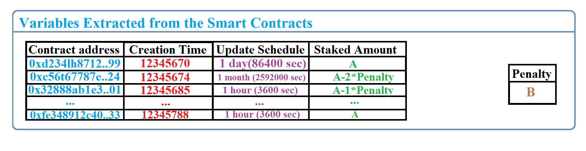
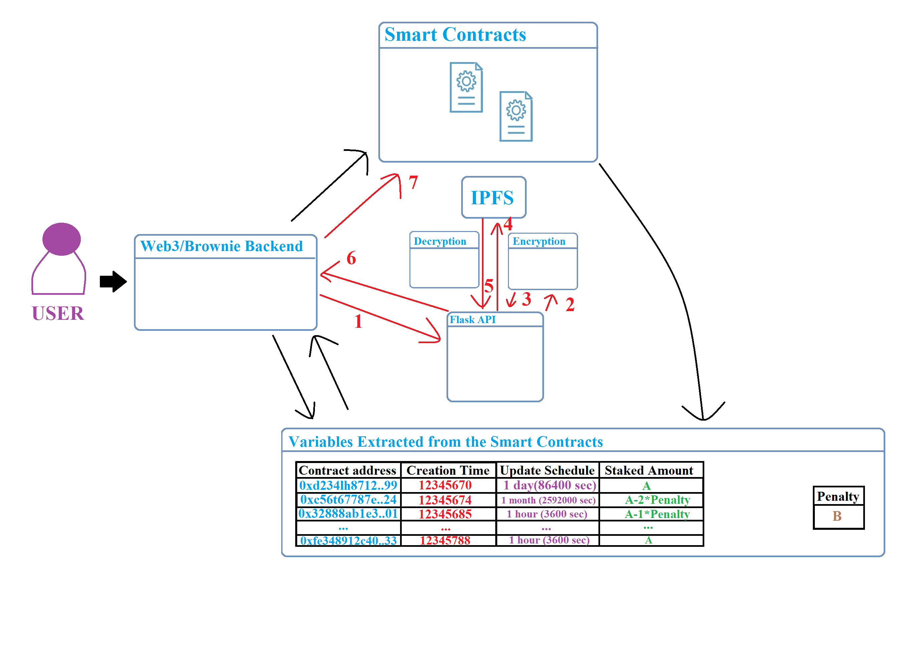
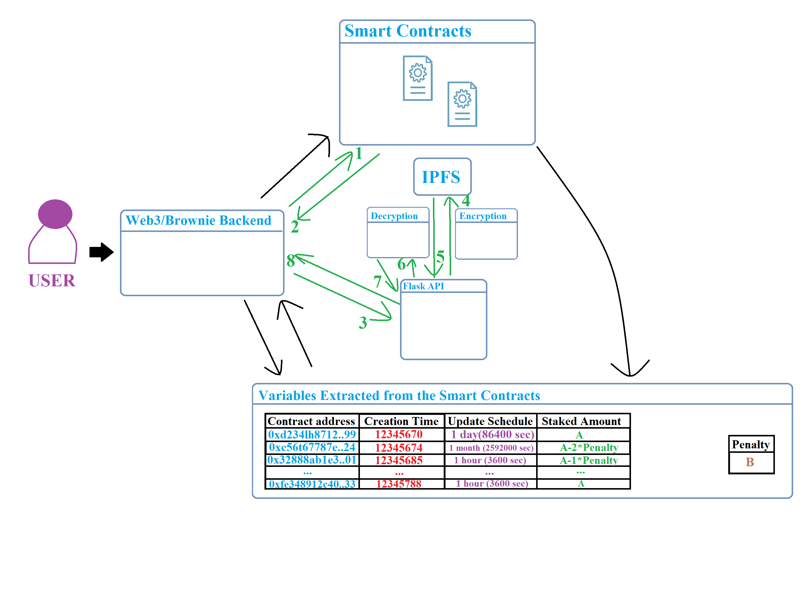

# Tokenomics and Gas Optimization
Every time that this doc mentions getting info on a variable from the smart contract, it is refering to getting those values from *view* functions in the DS samrt contract. This functions don't cost any gas to the foundation because they are called via RPC. This way only the Dohrnii local node has to do the calculation and therefore the gas cost is simulated.
1) Creator must stake A amount of DHN tokens in order to create a new data set. This tokens are staked directly in that DS contract
2) Every time the creator misses an upload schedule, he incurs in a penalty of value B. This penalty is taken by the Dohrnii organization, directly from the staked tokens in the corresponding DS contract. This penalties will help the Foundation pay for the operation. But how do we now if the update schedule has been broken without spending a lot of gas (constantly checking within the contract)?
     - **I)**:After creating the DS, the Dohrnii server backend saves the creation time, the update schedule (*updateSchedule*), the staked amount (*stakedAmount*), the penalty and the contract address of the DS in a database;
  
     - **II)**:Everytime someone calls the "requestURL()" functionin the DS smart contract, we read the block.timestamp, the current *lastUpdated* value and see if
    >                                block.timestamp>lastUpdated+updateSchedule
      aka, we see if the current time is greater than the last time the DS was updated (*lastUpdated*) plus the update schedule time (*updateSchedule*)
     - **III)**:If the condition in **II** is not met and the *lastUpdated* variable has not change, than nothing is changed and we just provide the requester with the URL
     - **IV)**:If the condition in **II** is not met and the *lastUpdated* variable has changed, than the database is updated and we provide the requester with the URL
     - **V)**:If the condition in **II** is met, we call the "penalty()" function in the DS smart contract which results in the creator loosing B amount of DHN tokens he initially staked. We update the *stakedAmount* variable (subtract the penalty from previous amount) in the database and check to see if it is now zero. If it is zero, than the "deleteDS()" function in the DS smart contract is called. If this does not happen the we update *lastUpdated* variable in the database but not in the smart contract and life goes on
3) Subscribers must choose their sub time option (ex: *[1 day, 1 week, 1 month]*), if more than one are provided, and pay the equivalent amount in DHN tokens (ex: *[1 day = C DHN , 1 week = D DHN , 1 month = E DHN]*). This payment is locked to both parties (creator and subscriber) until one of 3 situations happens:
    - **A. The subscription time ends**: if the subscription time has ended, the subscriber has had the product he has payed for, so the creator can now withdraw that subscribers payment. This is done  when the creator calls the "withdrawFunds()" functions in the DataSet.sol smart contract. The creator pays the gas fee for this operation so it is not advised to constantly spam it
    - **B. The Data set is eliminated by the creator**: this can happen because the creator decided to trigger the "deleteDS()" function in the DataSet.sol smart contract, for whatever reason. This function basically runs the same code as as "withdrawFunds()" and sends the rest of the funds to the subscribers who have their subscription cut short, and so don't have to pay the creator. This function is evry gas intensive so the creators are disincentivized from creating and deleting DSs often
    - **C. The Data set is eliminated due to zero stake**: because the creator has missed so many update schedules that the penalties have depleted all of his initially staked DHN tokens (aka his staked tokens become 0). This verified in the backend server of the Dohrnii foundation, as it was described in **V**.
  
# Backend structure
## IPFS Upload

## IPFS Download

